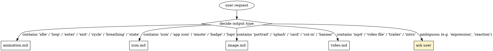
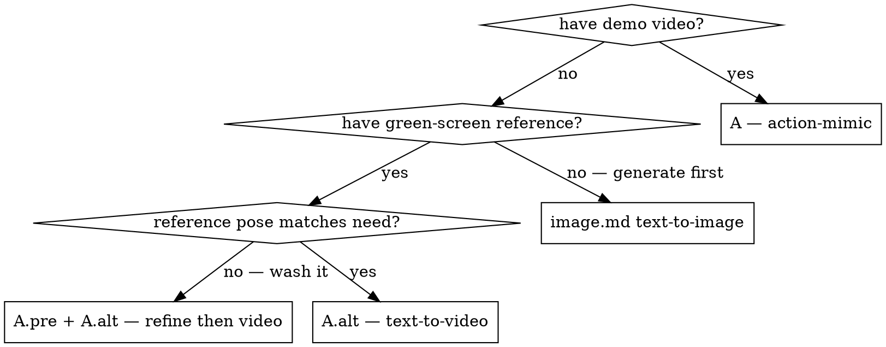

# Orchestrator — Toward end-to-end automation

The skill ships an **interactive mode** by default: the agent asks for model
choice, pastes prompts for confirmation, waits on user `go` before clicking
generate. This is intentional — liblib spend is real money and the agent
shouldn't burn it autonomously.

This reference describes the path toward an **orchestrator mode** where the
agent runs the loop end-to-end for low-risk operations. The orchestrator is
not (yet) fully built; this file is the design and the contract for
contributors picking up the work.

## Interactive vs orchestrated

| Phase | Interactive (today) | Orchestrated (proposed) |
|---|---|---|
| Output-type choice | Agent asks user | Agent infers from task description ("make an idle" → animation, "make an icon" → icon) |
| Path choice (A / A.pre / A.alt) | Agent asks user | Agent infers — has demo video? A. Has reference? A.pre+A.alt. Else A.alt. |
| Model choice | **User decides** | **User-pinned default** in `characters.notes` or new column; agent only deviates with explicit user opt-in for this run |
| Prompt construction | Agent drafts, user confirms | Agent drafts, **self-checks against three iron rules** ([path-a-alt](path-a-alt-text-to-video.md)), then submits |
| Generate click | User says "go" | Agent submits — credit cap configurable per session |
| Post-process (mask / despill / WebP) | Agent runs | Agent runs |
| Archive + inject | Agent runs `lab.py` chain | Agent runs `lab.py` chain |
| Report | Agent reports completion | Agent reports completion |

## Required guardrails before orchestrator ships

The orchestrator **must not** trip these:

1. **Per-session credit cap** — `LIBU_CREDIT_BUDGET=200` env var. Agent
   tallies `--credits` across all `lab.py gen` calls in the session and
   refuses further generations once budget is exceeded.
2. **Mandatory user gate on first failed generation** — if iron-rule self-check
   passes but the output visibly fails (low confidence in a quality scorer, or
   user says "this looks wrong"), the agent **must** drop back to interactive
   mode and not auto-retry.
3. **No autonomous model upgrade** — agent cannot escalate from Seedance 1.5
   Pro to Seedance 2.0 VIP (price spike) without explicit user opt-in.
4. **`--dry-run` parity** — every `lab.py` write subcommand should grow a
   `--dry-run` flag so the orchestrator can plan its sequence and ask the
   user to greenlight the plan as one decision, not 8.

## Decision tree (output-type inference)



The labels are heuristics, not contracts — when ambiguous, fall back to
interactive mode.

## Path inference



## Prompt self-check

Before submitting any text-to-video prompt, the orchestrator must run regex
checks for iron-rule violations:

| Iron rule | Forbidden tokens (case-insensitive) |
|---|---|
| #1 No timestamps | `\b第\s*\d+\s*秒`, `\b\d+\s*-\s*\d+\s*秒`, `\bafter\s+\d+\s*seconds?`, `\b\d+s\b` |
| #2 No appearance | character-specific words from `references/characters/<slug>.md` "Banned words" section |
| #3 No secondary-part motion | `呆毛`, `头发飞`, `头发飘`, `发丝`, `裙摆`, `hair (flying|whipping|fluttering)` (heuristic — may false-positive) |

Hits → fail closed: report violations to user, drop back to interactive mode.

## State machine

```
PLAN  →  PROMPT_DRAFT  →  PROMPT_CHECK  →  SUBMIT  →  WAIT
                                                       │
                                       FAIL  ←─────────┤
                                       │               ▼
                                       │              POST_PROCESS
                                       │               │
                                       │               ▼
                                       │              ARCHIVE
                                       │               │
                                       │               ▼
                                       └──→ INTERACTIVE_HANDOFF    DONE
```

`INTERACTIVE_HANDOFF` is the safe fallback for any unexpected state.

## Implementation status

- ☐ Output-type inference (regex heuristics)
- ☐ Path inference (state machine on user-provided context)
- ☐ Prompt self-check (regex iron-rule lint)
- ☐ `lab.py --dry-run` across write commands
- ☐ Per-session credit budget env var + tally
- ☐ Quality scoring on output frames (perceptual diff vs reference image, OCR for stray characters)
- ☐ "Halt and ask" predicate (visible failures, ambiguous user intent, model error)

Open an issue (label: `orchestrator`) before starting on any of these to
coordinate with current efforts.
